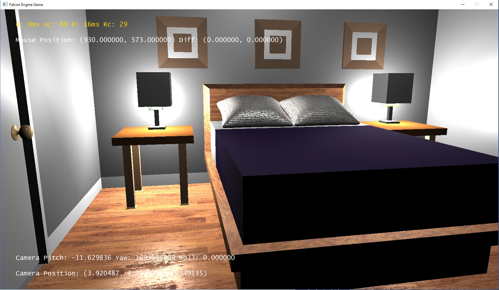

Falcon Engine
===
An OpenGL 3D Graphics Engine for study and academic use.

Showcase
===

Reference
===
1. David Eberly. *Wild Magic* and *Geometry Tool* Source Code.
2. David Eberly. *3D Game Engine Design: A Practical Approach to Real-Time Computer Graphics*, 2nd, 2006.
3. Patrick Cozzi, Kevin Ring. *3D Engine Design for Virtual Globes*, 2011.

Disclaimer
===
You would find some similiarity in code, compared to the David Eberly's [Geometry Tool](https://www.geometrictools.com/)
Project. 

In fact, this project started as my first attempt to build a rendering engine.
As I learned more and more about David Eberly's work, I decided to prune code from 
Geometry Tool into my own renderer. By doing so I actually learned faster, given 
the necessary framework and logics in Geometry Tool.

So I don't claim originality for entirety of this project. But the current code base
has been diverged from the original framework in Geometry Tool.
